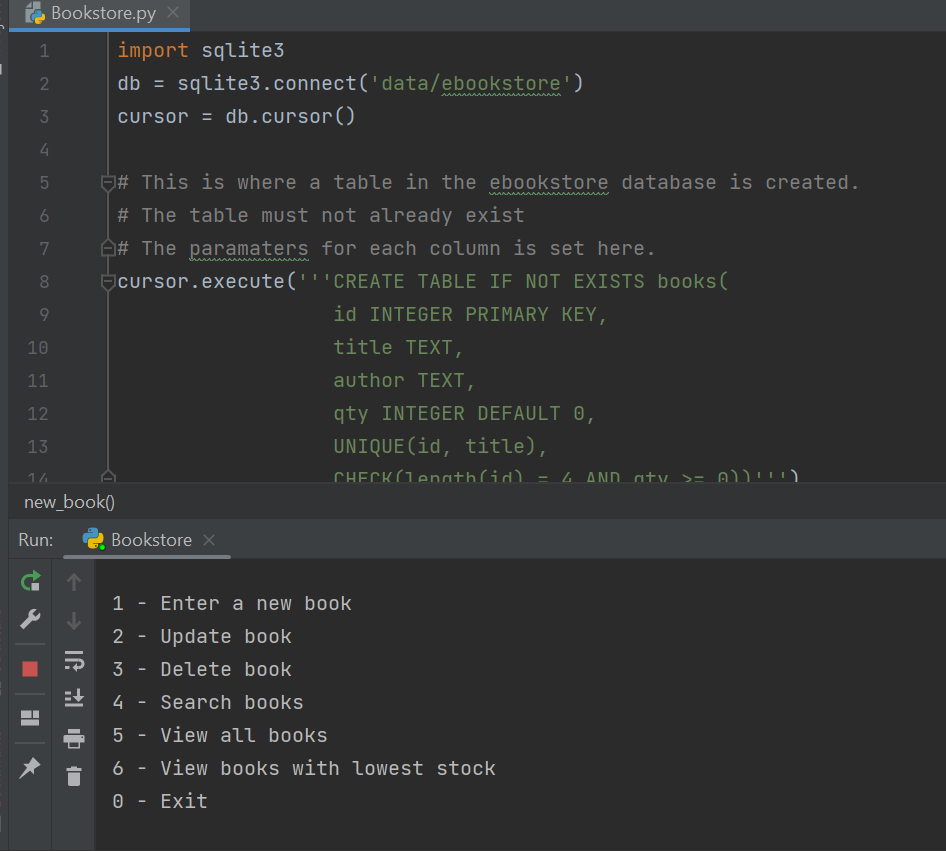

# Bookstore-inventory-tracker
A simple Python program using databases to track and manage a bookstore's inventory

# Instalation

This project uses Python and an IDE to work.
If you do not have Python, you can download it here: https://www.python.org/downloads/
If you do not have an applicable IDE you can download a free version of PyCharm here: https://www.jetbrains.com/pycharm/download/

1. Create a folder on your PC to store the program.
2. Download all the files to a folder on your desktop.
3. Right-click on the .py file and open with PyCharm or your chosen IDE
4. Once the file has loaded in PyCharm, click the green triangle in the top right corner to run the program

# Usage

Once the program is running, follow the prompts and type in your request.

##### The options are as follows:
1 - Enter a new book
2 - Update book
3 - Delete book
4 - Search books
5 - View all books
6 - View books with lowest stock

#### Note:
There are already some books in the database.
To delete them, use the program and delete the books.

